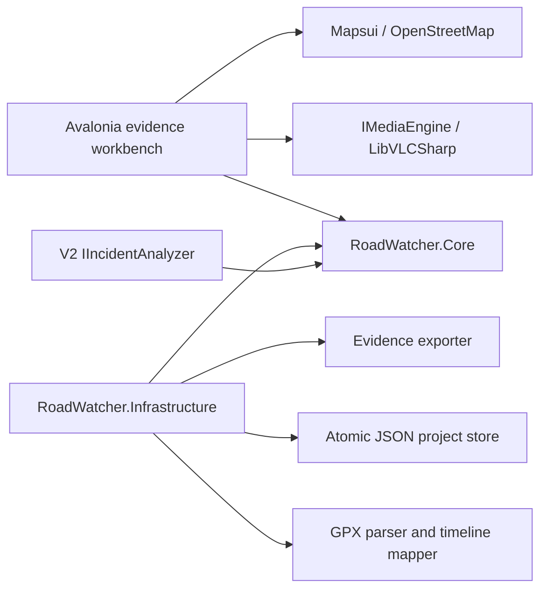

# Architecture

RoadWatcher uses a ports-and-adapters structure so playback, mapping, OCR, and future CV models can evolve without changing the evidence model.

## Projects

- `RoadWatcher.App`: Avalonia UI, view models, composition root, native file pickers, media/map controls.
- `RoadWatcher.Core`: versioned evidence model, timeline math, interfaces, validation.
- `RoadWatcher.Infrastructure`: JSON persistence, GPX parsing, reverse-geocode adapters, hashes, export assembly.
- `RoadWatcher.Tests`: high-value domain, persistence, and smoke tests.

## Core interfaces

- `IMediaEngine`: load, play, pause, seek, speed, frame capture, and media events.
- `IVirtualTimeline`: maps project time to a source clip/time and preserves gaps.
- `IGpxTrackService`: parses track points and interpolates telemetry at project time.
- `ILocationResolver`: turns coordinates into editable intersection/address suggestions.
- `IPlateRecognizer` and `IVehicleColorEstimator`: V1 local suggestions from explicit crops.
- `IOverlayRenderer`: composable telemetry/object/lane layers.
- `IEvidenceExporter`: deterministic package and manifest generation.
- `IIncidentAnalyzer`: V2 CV seam returning suggestions with confidence and regions.

## Evidence invariants

- Source media is never modified.
- Project time, source media ID, and source time are stored together for every marked observation.
- Machine output remains a suggestion until user-confirmed.
- Derived media records the inputs, processing version, command/settings, timestamp, and hash.
- JSON changes are written to a temporary file, flushed, and atomically replaced with rolling backups.

## UI composition

The selected evidence workbench is a four-region desktop shell: navigation, dominant player, resizable Context dock (map plus overlay layers), and incident inspector. A multi-track virtual timeline spans the review area below. Avalonia `Grid`, `GridSplitter`, `ListBox`, `DataGrid`, `Flyout`, and `StorageProvider` are preferred before custom controls.

