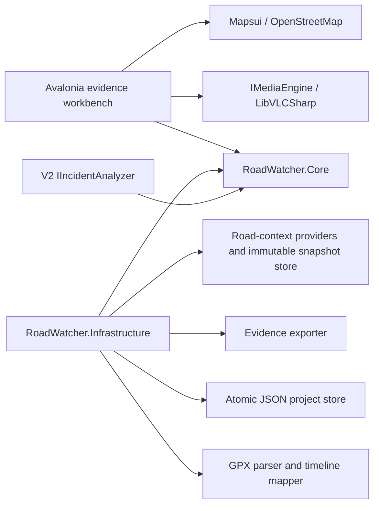

# Architecture

RoadWatcher uses a ports-and-adapters structure so playback, mapping, OCR, and future CV models can evolve without changing the evidence model.

## Projects

- `RoadWatcher.App`: Avalonia UI, view models, composition root, native file pickers, media/map controls.
- `RoadWatcher.Core`: versioned evidence model, timeline math, interfaces, validation.
- `RoadWatcher.Infrastructure`: JSON persistence, GPX parsing, reverse-geocode adapters, hashes, export assembly.
- `RoadWatcher.Tests`: high-value domain, persistence, and smoke tests.

## Core interfaces

- `IMediaEngine`: load, play, pause, seek, speed, frame capture, and media events.
- `IVirtualTimeline`: maps project time to a source clip/time and preserves gaps.
- `IGpxTrackService`: parses track points and interpolates telemetry at project time.
- `ILocationResolver`: turns coordinates into editable intersection/address suggestions.
- `IPlateRecognizer` and `IVehicleColorEstimator`: V1 local suggestions from explicit crops.
- `IOverlayRenderer`: composable telemetry/object/lane layers.
- `IEvidenceExporter`: deterministic package and manifest generation.
- `IRoadContextProvider`: explicit, bounded advisory-map source adapter; implementations retain their source/status metadata and never participate in playback.
- `IFfmpegJobQueue`: one global, two-worker process queue for proxies, thumbnails, and derived review clips. It owns progress, cancellation, and temporary-output cleanup instead of allowing controls to start encoders independently.
- `IIncidentAnalyzer`: V2 CV seam returning suggestions with confidence and regions.

## Evidence invariants

- Source media is never modified.
- Project time, source media ID, and source time are stored together for every marked observation.
- Machine output remains a suggestion until user-confirmed.
- Derived media records the inputs, processing version, command/settings, timestamp, and hash.
- Advisory road context is stored in a separately hash-verified immutable snapshot, never copied into an incident, and excluded from export unless a reviewer explicitly selects the non-evidence reference option.
- JSON changes are written to a temporary file, flushed, and atomically replaced with rolling backups.

## UI composition

The selected evidence workbench is a four-region desktop shell: navigation, dominant player, resizable Context dock (map plus overlay layers), and incident inspector. A multi-track virtual timeline spans the review area below. Avalonia `Grid`, `GridSplitter`, `ListBox`, `DataGrid`, `Flyout`, and `StorageProvider` are preferred before custom controls.

The native video surface is the approved LibVLCSharp Avalonia `VideoView`. `EmbeddedVideoView` is a lifecycle-only adapter that reapplies the native child-window handle when an initially hidden surface is created; it does not replace or customize VLC rendering. Telemetry is composed above the native surface with standard Avalonia controls so LibVLCSharp does not create its optional floating content window.

The Context dock's Road context section is a reviewer-triggered map aid. Its provider adapters run only on load/refresh, persist an immutable project-local snapshot with feature-level provenance, and render it below recorded GPX/telemetry. Ontario Road Network names and global named OSM ways are stored as hidden road-reference features, so playback resolves a road/intersection label from the snapshot without HTTP. The visual presenter clusters same-category point markers in screen space and never alters source geometry or provenance.

`RoadWatcherSettings` is app-local (`%LocalAppData%\RoadWatcher\settings.json`) and never enters a project or export. It owns the log level, FFmpeg executable preference, and preferred map style. Serilog writes rolling local diagnostics separately from project evidence.
